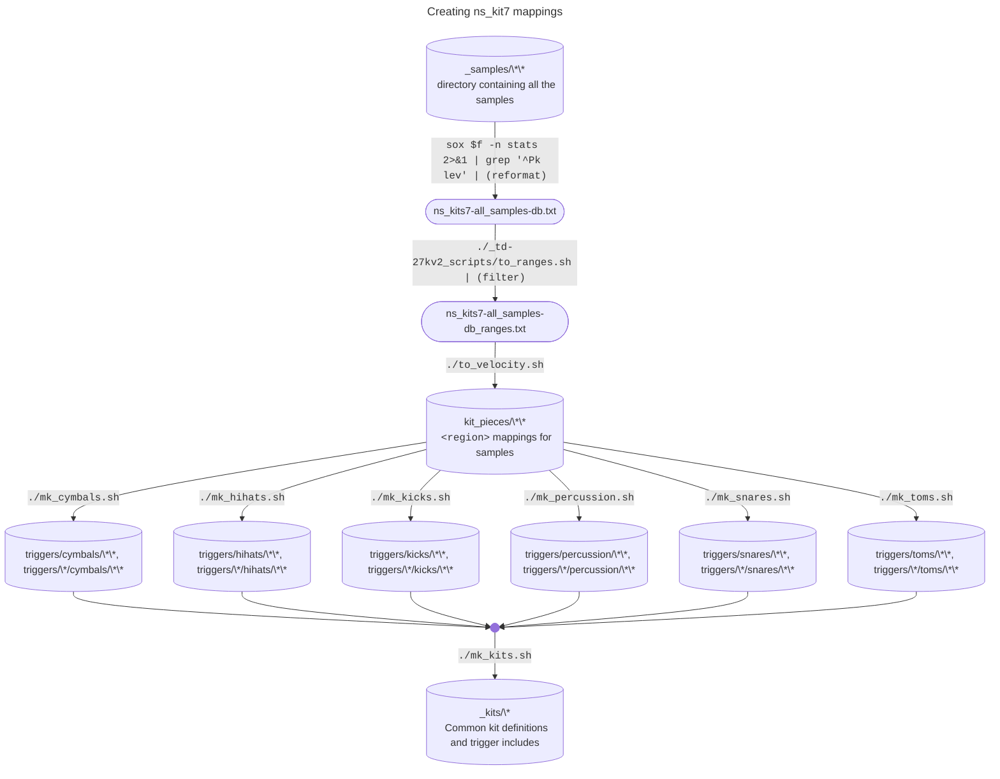

# Creating ns_kit7 mappings
Before you start, read this:

| **THE MIDI MAPPING IS WHAT WILL SURPRISE YOU** |
|-|


First, we need the "true peak" levels of each sample (not RMS or whatever I got from VelLeveler originally).

Assuming the current working directory contains this `README.md`,
in `..`, link `_samples` to wherever the samples live.

Get `sox` installed and run the following in `..`:
```bash
find _samples/ -type f -name \*.wav | sort | while read f
do
    echo $f $(sox $f -n stats 2>&1 | grep '^Pk lev')
done | while read f x x x pk y
do
    echo $pk ${f#_samples/}
done > ns_kits7-all_samples-db.txt
```

Next, the `to_ranges.sh` script needs running against these raw values.  Run the folowing in `..`:
```bash
{
    grep '_[0-9][0-9][0-9]\.wav$' ns_kits7-all_samples-db.txt | grep -v _misc/    | ./_td-27kv2_scripts/to_ranges.sh;
    for x in a b c;
    do
        grep '_'$x'[0-9][0-9][0-9]\.wav$' ns_kits7-all_samples-db.txt | grep -v _misc/ | ./_td-27kv2_scripts/to_ranges.sh | sed -e 's!^[^;]*;[^;]*; !&'$x'_!';
    done;
    for x in p r x;
    do
        grep '_[0-9][0-9][0-9]'$x'\.wav$' ns_kits7-all_samples-db.txt | grep -v _misc/    | ./_td-27kv2_scripts/to_ranges.sh | sed -e 's!^[^;]*;[^;]*; !&'$x'_!';
    done;
} > ns_kits7-all_samples-db_ranges.txt
```

Then run `to_velocity.sh` (here) to create `kit_pieces/` from scratch:
```bash
./to_velocity.sh ../ns_kits7-all_samples-db_ranges.txt ../ns_kits7-all_samples-db.txt
```

For each of the kit pieces, the triggers need to be created.
These define what can be used in a kit.
Each script has a standard output - i.e. a fixed set of trigger notes - from `1` to `n`,
depending on the maximum number of articulations.
The results are in `triggers/`.
```bash
for t in cymbals hihats kicks percussion snares toms
do
  ./mk_${t}.sh
done
```
The "kit" files I produced follow the "original" ns_kit7 drum kits.
Each "kit" file, therefore, pulls in a set of cymbals and toms, a hihat, kick, snare and percussion for each beater and tuning from the original layouts.

However, like the triggers,
each of the kits starts from note 1 and runs through, renumbering the triggers
-- and, because the triggers are consistent, each kit is consistent (i.e. trigger define `$tambourine_thm`, for example, is present in each kit and has the same MIDI Note number).
```bash
./mk_kits.sh
```
If you compare `rock_stx_snare_on.sfz` with my original mapping (that directly followed)
Douglas's, including the articulations, you will see that each articulation now gets
its own MIDI Note number instead of using MIDI CC values.

Whilst this means it's easier to trigger the articulations,
it does mean you will need to do some remapping --
either to set up your controller to follow my weird mapping scheme
or to put a MIDI Mapper in between.

Under `jsfx`, you will find `TD-27-to-ns_kit7.jsfx`, which maps the default TD-27
triggers to this layout.
(Hi-hat splash note is an entire chapter on its own...)

You don't need to use `./mk_kits.sh`.
You could create kits from the kit piece triggers in a variety of different ways.
The way I have done it is quite memory intensive.
You could load all the triggers and use `<master>` and `loccNN/hiccNN` to select kits,
for example.
Or split into each beater and do the same.
You could even reconstruct the original way
the articulations are handled and triggers are numbered.
Whatever you do, it is a good idea to renumber into a complete set all of the triggers,
rather than having each `1` to `n` at kit piece level.